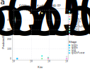

---
title: An immune complex binding model predicts effector cell response across diverse disease models
keywords:
- FcγR receptors
- immunology
- antibodies
- effector function
lang: en-US
date-meta: '2021-07-03'
author-meta:
- Zhixin Cyrillus Tan
- Stephen Lees
- Falk Nimmerjahn
- Aaron S. Meyer
header-includes: |-
  <!--
  Manubot generated metadata rendered from header-includes-template.html.
  Suggest improvements at https://github.com/manubot/manubot/blob/master/manubot/process/header-includes-template.html
  -->
  <meta name="dc.format" content="text/html" />
  <meta name="dc.title" content="An immune complex binding model predicts effector cell response across diverse disease models" />
  <meta name="citation_title" content="An immune complex binding model predicts effector cell response across diverse disease models" />
  <meta property="og:title" content="An immune complex binding model predicts effector cell response across diverse disease models" />
  <meta property="twitter:title" content="An immune complex binding model predicts effector cell response across diverse disease models" />
  <meta name="dc.date" content="2021-07-03" />
  <meta name="citation_publication_date" content="2021-07-03" />
  <meta name="dc.language" content="en-US" />
  <meta name="citation_language" content="en-US" />
  <meta name="dc.relation.ispartof" content="Manubot" />
  <meta name="dc.publisher" content="Manubot" />
  <meta name="citation_journal_title" content="Manubot" />
  <meta name="citation_technical_report_institution" content="Manubot" />
  <meta name="citation_author" content="Zhixin Cyrillus Tan" />
  <meta name="citation_author_institution" content="Bioinformatics Interdepartmental Program, University of California, Los Angeles" />
  <meta name="citation_author_orcid" content="0000-0002-5498-5509" />
  <meta name="citation_author" content="Stephen Lees" />
  <meta name="citation_author_institution" content="Department of Bioengineering, University of California, Los Angeles" />
  <meta name="citation_author" content="Falk Nimmerjahn" />
  <meta name="citation_author_institution" content="Friedrich-Alexander-University of Erlangen-Nürnberg" />
  <meta name="citation_author" content="Aaron S. Meyer" />
  <meta name="citation_author_institution" content="Department of Bioengineering, University of California, Los Angeles" />
  <meta name="citation_author_institution" content="Bioinformatics Interdepartmental Program, University of California, Los Angeles" />
  <meta name="citation_author_institution" content="Jonsson Comprehensive Cancer Center, University of California, Los Angeles" />
  <meta name="citation_author_institution" content="Eli and Edythe Broad Center of Regenerative Medicine and Stem Cell Research, University of California, Los Angeles" />
  <meta name="citation_author_orcid" content="0000-0003-4513-1840" />
  <meta name="twitter:creator" content="@aarmey" />
  <link rel="canonical" href="https://meyer-lab.github.io/FcRegression.jl/" />
  <meta property="og:url" content="https://meyer-lab.github.io/FcRegression.jl/" />
  <meta property="twitter:url" content="https://meyer-lab.github.io/FcRegression.jl/" />
  <meta name="citation_fulltext_html_url" content="https://meyer-lab.github.io/FcRegression.jl/" />
  <meta name="citation_pdf_url" content="https://meyer-lab.github.io/FcRegression.jl/manuscript.pdf" />
  <link rel="alternate" type="application/pdf" href="https://meyer-lab.github.io/FcRegression.jl/manuscript.pdf" />
  <link rel="alternate" type="text/html" href="https://meyer-lab.github.io/FcRegression.jl/v/03da4ab01f795a96ef3eec8eb9e0880aaa696de4/" />
  <meta name="manubot_html_url_versioned" content="https://meyer-lab.github.io/FcRegression.jl/v/03da4ab01f795a96ef3eec8eb9e0880aaa696de4/" />
  <meta name="manubot_pdf_url_versioned" content="https://meyer-lab.github.io/FcRegression.jl/v/03da4ab01f795a96ef3eec8eb9e0880aaa696de4/manuscript.pdf" />
  <meta property="og:type" content="article" />
  <meta property="twitter:card" content="summary_large_image" />
  <link rel="icon" type="image/png" sizes="192x192" href="https://manubot.org/favicon-192x192.png" />
  <link rel="mask-icon" href="https://manubot.org/safari-pinned-tab.svg" color="#ad1457" />
  <meta name="theme-color" content="#ad1457" />
  <!-- end Manubot generated metadata -->
bibliography: []
manubot-output-bibliography: output/references.json
manubot-output-citekeys: output/citations.tsv
manubot-requests-cache-path: cache/requests-cache
manubot-clear-requests-cache: false
...

<small><em>
This manuscript
was automatically generated on July 3, 2021.
</em></small>

## Authors

+ **Zhixin Cyrillus Tan** 
    ORCID 
    [0000-0002-5498-5509](https://orcid.org/0000-0002-5498-5509)
    · Github
    [cyrillustan](https://github.com/cyrillustan) 
  <small>
     Bioinformatics Interdepartmental Program, University of California, Los Angeles
  </small>

+ **Stephen Lees**  
  <small>
     Department of Bioengineering, University of California, Los Angeles
  </small>

+ **Falk Nimmerjahn**  
  <small>
     Friedrich-Alexander-University of Erlangen-Nürnberg
  </small>

+ **Aaron S. Meyer** 
    ORCID 
    [0000-0003-4513-1840](https://orcid.org/0000-0003-4513-1840)
    · Github
    [aarmey](https://github.com/aarmey)
    · twitter
    [aarmey](https://twitter.com/aarmey) 
  <small>
     Department of Bioengineering, University of California, Los Angeles; Bioinformatics Interdepartmental Program, University of California, Los Angeles; Jonsson Comprehensive Cancer Center, University of California, Los Angeles; Eli and Edythe Broad Center of Regenerative Medicine and Stem Cell Research, University of California, Los Angeles
  </small>

## Abstract {.page_break_before}

Antibodies are crucial and central regulators of the immune response. Those of the IgG isotype interact with Fc gamma receptors on effector cells. The effector response of IgGs encompasses multiple cell types (e.g., macrophages, monocytes, etc.) and multiple processes (e.g., antigen presentation, cytokine response, phagocytosis, etc.). An individual IgG can be either pro- or anti-inflammatory depending upon its Fc domain composition and the context. IgGs are particularly versatile agents for therapeutic treatment due to their immunotherapeutic effects as well as those of direct antigen binding and opsonization. Indeed, IgG molecules comprise a broad range of approved therapies, many of which are known to rely in part on effector cell response. At the same time, the multiplicity throughout—of constant region composition, Fc gamma receptors, cell populations, and antigen binding in combination—makes precisely understanding, measuring, and manipulating effector function a yet-elusive goal.

## Summary points

- An equilibrium, multivalent binding model can be extended to incorporate hetero-valent complexes and cells of mixed receptor expression.
- An FcγR binding model predicts effector-elicited cell killing across multiple disease models.
- Simple corrections can account for non-cellular (complement and neutralization) antibody effects.
- Model comparison can identify differences in essential effector cell populations.

## Introduction

Antibodies' therapeutic potential is demonstrated by their status as a broad class of effective agents across autoimmune diseases, infection, and cancer. Their versatility is enabled through an antibody’s selectivity toward target antigen, as determined by its variable region, and ability to elicit effector cell responses, dependent upon the composition of its constant Fc region. Antibodies of the IgG type direct effector response by binding to the FcγR family of receptors. FcγR activation is driven by multiple IgG clustering the receptors. Depending upon the configuration of receptors, this interaction may promote or prevent effector response. Thus, the mechanism of FcγR activation ensures that multiple IgG are present whenever eliciting effector response.

One capability elicited by effector cells is clearance of infected or otherwise pathogenic cells. Clearance can occur through two functionally distinct mechanisms: antibody-dependent cellular cytotoxicity (ADCC) or antibody-dependent cell-mediated phagocytosis (ADCP). However, both mechanisms are (1) regulated by the family of FcγRs present on effector cells, (2) modulated by the identity of the Fc region present on an IgG [@pmid:16322460], (3) performed by multiple cell types [@pmid:22169040; @pmid:24177426], and (4) influenced by properties of antigen engagement [@pmid:29958103; @pmid:17709495]. This multilayered complexity is a central challenge to engineering antibodies with desirable cell-killing functions, as well as understanding successful and dysregulated endogenous immunity. Our team recently demonstrated that a multivalent binding model of immune complex (IC—IgG-antigen complex) binding to FcγRs accurately captured and could predict *in vitro* binding across various IgG isotypes [@pmid:29960887]. Further, it could accurately predict antibody-elicited tumor cell killing *in vivo* across antibodies of varied isotype, glycosylation status, and FcγR knockout animals [@pmid:29960887]. Directly quantifying and predicting cell clearance made it possible to accurately predict and optimize for antibody-mediated cell clearance regardless of whether it occurred by ADCC or ADCP.

Endogenous antibody responses universally involve Fc of diverse isotype and glycosylation in combination. Antibodies of different Fc composition, but identical antigen binding, may have properties other than the additive combination of either alone. A consequence of this is that, within a mixture, minor species (e.g., glycosylation variant) can have an outsized effect promoting or preventing cell killing. Even when recombinantly manufacturing a single monoclonal therapeutic agent, heterogeneity exists in the glycosylation forms derived [@pmid:26775146; @pmid:18050193]. Knowledge of how these different forms influence the behavior of one another would allow one to increase or reduce cell killing by adjusting the mixture of glycosylation forms. This would also help guide evaluation of biosimilars by determining whether glycosylation forms present at small fractions might influence overall therapeutic efficacy. On the side of the effector cells involved in mediating therapeutic antibody dependent effects, it has become clear that in addition to NK cells (expressing only one activating FcγR (FcγRIIIA), tissue resident macrophages and bone marrow derived monocytes participate in cytotoxic antibody dependent target cell clearance. In contrast to NK cells, these myeloid cell subsets express all activating (excepting inflammatory monocytes lacking human (h)FcγRIIIA or mouse (m)FcγRIV) and the inhibitory FcγRIIB. Thus, mixed IC may trigger all or specific subsets of activating/inhibitory FcRs, resulting in a further complexity. Despite the ability of multiple activating FcRs on myeloid effector cells our previous studies have demonstrated that individual IgG subclasses, such as mIgG2a/2c for example, may mediate their activity through select activating FcγRs despite their capacity to bind to other activating FcRs [@pmid:16322460].

Here, we build upon our earlier model development in two key ways. First, we evaluate the ability of a multi-valent binding model to predict effector cell-elicited clearance across a panel of disease models. Second, we extend our multivalent binding model to hetero-valent immune complex mixtures. This demonstrates the generality of modeling effector response through a mechanistic binding model, and enables predictions for polyclonal antibody responses.

## Results

### A multivalent binding model accurately accounts for in vitro binding of IgG mixtures

- Introduction of the computational model
- Introduction of mixture binding experiment, show some sample results (all in SI)
- Various measured vs predicted plots (different subsets to show no systematically off)
- Measure vs predicted binding synergy, isobologram fit (?)

![**A multivalent binding model quantifies potential for synergy in immune complex binding.** A) Schematic of the multivalent binding model. B) Schematic of how synergy or antagonism is calculated from binding predictions. C) Example of predicted synergy in IC. D) Example of predicted synergy in cMO activity. E) Grid of calculated synergy quantities for all pairs of IgG with murine cMO. F) Calculated synergy values with changes in IC concentration. Each point represents an individual IgG pair. Receptor expression assumed to be that measured for murine cMO. G) Calculated synergy values with variation in IC valency. Conditions match those used in (F). H) Calculated synergy values with proportional variation in receptor expression. Conditions match those used in (F).](figure1.svg "Figure 1"){#fig:bindingS width="100%"}

To model the effects of polyclonal antibody responses, we extended a simple, equilibrium binding model we previously used to model antibody effector response [@pmid:29960887]. Briefly, immune complexes are assumed to bind to FcγRs on the cell surface with monovalent binding kinetics, and then can engage additional receptors with a propensity proportional to their affinity ([@fig:bindingS]A). This model then enables us to predict the binding outcome for immune complexes formed from mixtures of antibodies, and ask whether these mixtures have distinct properties from either single-antibody complex ([@fig:bindingS]B). We defined synergy or antagonism in the mixture's effects as a difference from the additive combination of each single antibody case.

With this model, we could identify predicted cases of synergistic or antagonistic binding or predicted effector response in effector cells ([@fig:bindingS]D/E). Responses generally deviated from additivity at higher concentrations and valency of immune complexes ([@fig:bindingS]F/G). This trend is consistent with the observation that non-additive interactions do not arise in the limit of small amounts of receptor binding (TODO). As expected, we observed little effect of proportional variation in receptor abundance ([@fig:bindingS]H). In total, this expanded model of antibody-FcγR interaction allows us to predict whether antibodies might have similar or distinct effects when present in combination.

### Regression unveils cell type functionality in disease models

To explore how effector cell binding leads to target cell killing, we reimplemented our previous model of antibody-elicited melanoma cell clearance. Building upon our earlier implementation, we refined how uncertainty is handled in the regression between binding and target cell clearance. Briefly, we calculate an "activity" based on the calculated amount of multimerized activating and inhibitory FcγR with each treatment. This is then regressed against each treatment's observed target cell depletion ([@fig:regression]a). Target cell depletion is a saturable process (one cannot get rid of more than 100% of cells) and so we previously used a `tanh` relationship to account for this effect [@pmid:29960887].

{#fig:regression width="100%"}

Having successfully refined our model of antibody-mediated melanoma clearance, we sought to evaluate the generalizability of our model for predicting other examples of antibody-mediated clearance. Injection of XXX antibody which binds to platelets and leads to ADCP serves as a model of ITP. Similarly to our model of melanoma, we regressed predicted immune complex formation and binding against effector cell-elicited platelet clearance.

### Verify predicted in vivo target cell depletion

- Choose the best, intermediate, and the worst for experiments
- Measured vs predicted depletion

{#fig:prediction width="100%"}

### Analyze synergistic effects in IgG mixture mechanism

- Various isobolograms BINDING TO ONE CELL TYPE, ACT of 1 cell type, and predicted depletion of ITP, (bind to one FcgR, predicted activity, predicted depletion)
- Analyze synergy in binding, cell activity, and overall depletion (Do we have cytokine secretion data?)
- Probably more analysis in the discussion section

![**Predicted synergistic/antagonistic immunothrombocytopenia (ITP) and melanoma IgG subclass pairs.** a,b) Predicted depletion caused by combinations of IgG2a and IgG3 across all cell types for two regression models: a) ITP, c) melanoma; b,d) Predicted depletion synergy caused by various IgG combinations across cell types for two regression models: b) ITP, d) melanoma; e,f) Predicted total activity or binding induced from a combination of IgG2a and IgG3 across cMO cells in the ITP model: e) activity, f) binding; g,h) Predicted activity or binding induced from a combination of IgG2a and IgG3 across FcgRIII on cMO cells in the ITP model: e) activity, f) binding](figure4.svg "Figure 4"){#fig:prediction width="100%"}

## Discussion

Discuss...

## Methods

### Data and Software Availability

All analysis was implemented in Julia, and can be found at <https://github.com/meyer-lab/FcgR.jl>.

### Generalized multi-ligand, multi-receptor multivalent binding model

To model polyclonal antibody immune complexes (ICs), we extended our previous binding model to account for ICs of mixed IgG composition [@pmid:29960887].

We define $N_L$ as the number of distinct monomer Fcs, $N_R$ the number of FcRs, and the association constant of monovalent Fc-FcR binding between Fc $i$ and FcR $j$ as $K_{a,ij}$. Multivalent binding interactions after the initial interaction have an association constant of $K_x^* K_{a,ij}$, proportional to their corresponding monovalent affinity. The concentration of complexes is $L_0$, and the complexes consist of random ligand monomer assortments according to their relative proportion. The proportion of ligand $i$ in all monomers is $C_i$. By this setup, we know $\sum_{i=1}^{N_L} C_i = 1$. $R_{\mathrm{tot},i}$ is the total number of receptor $i$ expressed on the cell surface, and $R_{\mathrm{eq},i}$ the number of unbound receptors $i$ on a cell at the equilibrium state during the ligand complex-receptor interaction.

The binding configuration at the equilibrium state between an individual complex and a cell expressing various receptors can be described as a vector $\mathbf{q} = (q_{1,0}, q_{1,1}, ..., q_{1,N_R}, q_{2,0},..., q_{2,N_R},q_{3,0},..., q_{N_L, N_R})$ of length $N_L(N_R+1)$, where $q_{i,j}$ is the number of ligand $i$ bound to receptor $j$, and $q_{i,0}$ is the number of unbound ligand $i$ on that complex in this configuration. The sum of elements in $\mathbf{q}$ is equal to $f$ , the effective avidity. For all $i$ in $\{1,2,..., N_L\}$, let $φ_{i,j} = R_{\mathrm{eq},j} K_{a,ij} K_x^* C_i$ when $j$ is in $\{1,2,...,N_R\}$, and $φ_{i,0} = C_i$. The relative amount of complexes in the configuration described by $\mathbf{q}$ at equilibrium is

$$v_{\mathbf{q},eq} = \binom{f}{\mathbf{q}} \frac{L_0}{K_x^* } \prod_{i=1\\ j=0}^{i=N_L\\ j=N_R}{{φ_{ij}}^{q_{ij}}},$$

with $\binom{f}{\mathbf{q}}$ being the multinomial coefficient. Then the total relative amount of bound receptor type $n$ at equilibrium is

$$ R_{\mathrm{bound},n} = \frac{L_0 f}{K_x^* } \sum_{m=0}^{N_L}φ_{mn} \left(\sum_{i=1\\ j=0}^{i=N_L\\ j=N_R}{{φ_{ij}}^{q_{ij}}}\right)^{f-1} .$$

By conservation of mass, we know that $R_{\mathrm{tot},n} = R_{\mathrm{eq},n} + R_{\mathrm{bound},n}$ for each receptor type $n$, while $R_{\mathrm{bound},n}$ is a function of $R_{\mathrm{eq},n}$. Therefore, each $R_{\mathrm{eq},n}$ can be solved numerically from its $R_{\mathrm{tot},n}$ measured experimentally. Similarly, the total relative amount of complexes bind to at least one receptor on the cell is

$$ L_{\mathrm{bound}} = \frac{L_0}{K_x^* } \left [\left(\sum_{i=1\\ j=0}^{i=N_L\\ j=N_R}{{φ_{ij}}^{q_{ij}}}\right)^f -1 \right] .$$

FcRs are activated through crosslinking. The amount of each kind of receptor in a multimerized complex can be calculated as

$$R_{\mathrm{multi},n} = \frac{L_0 f}{K_x^* } \sum_{m=0}^{N_L}φ_{mn} \left[\left(\sum_{i=1\\ j=0}^{i=N_L\\ j=N_R}{{φ_{ij}}^{q_{ij}}}\right)^{f-1}-1 \right] .$$

### In-Vivo Regression

Regression against in vivo effectiveness of mIgG treatments was performed by non-linear least-squares (NonNegLeastSquares package). Association constants for all combinations of mIgG and mFcγR were obtained from previous experimental measurements [@pmid:9551950] [@pmid:4171710]. Depletion was represented as the percent reduction in the number of target cells for each disease model. Using an assumed ligand concentration and valency, as well as mFcγR expression, activities of each cell population (cellweights) were calculated using the multi-receptor model. The individual receptor activities that help determine depletion are fit through optimization of the regression residuals. These receptor activites are multiplied by the number of bound receptors for a cell type and multiplied by the cell weight to get the final cell activities. To convert the activities to a limited range of depletion, (e.g. one cannot have a reduction of 200%), the regression was transformed by an exponential linker function such that the predicted effectiveness: $y = 1-\exp(-X*p)$ so that $\lim_{x\to\infty} y(x) = 1$. $X$ is the predicted mFcγR activity for each cell line according to our model, and p is the regression weights.

### Additivity Model

We define synergy in the different IgG mixtures' effects as differences from the calculated additive combination of each single antibody case. Synergy can be calculated for depletion in the disease model types, the activity of a specified cell type, or simple binding to the cell. Synergy is calculated given a set of parameters specifying whether the species of interest is human or murine, the IC concentration ($L_0$), valency (f), and the identity of the two IgGs of interest; for disease models, the results of our fitRegression function must be passed in as well in order to pass on fitted cell weights and receptor activities. For the case of activity in murine ncMOs, murine would be set to true and Cellidx would be set to 1. Kav, a matrix of association constants for IgGs and Fc receptors, is imported to be used in the binding model. Unless a specific Fc receptor is specified in RecepIdx, FcExpr is set to the average expression of the cell type. 

Once the parameters have been obtained, we must calculate the predicted single IgG responses (D1 and D2) as well as the additive and mixture responses (combine). The single drug responses are the predicted cell activities caused by a dose of a single specified IgG with an IC concentration of $L_0$. Because the binding model returns a single value of activity of the cell at a given IC concentration, it must be iterated over an array of IC concentrations in order to produce the single drug curve. The binding model is called one hundred times with an $L_0$ increasing from 0 to $L_0$. The mixed drug response, however, stays at a contant $L_0$ but changes in the ratio of IgG makeup.

For activity, the additive curve is found by adding the two single drug response curves. A value for synergy can then be determined by finding the area between the additive curve and the predicted mixture curve by numerical integration. This process is then repeated for all IgG combinations and with each cell type.

When considering depletion rather than activity, activity is calculated as described previously but must then correspond to a depletion for each disease type. Fit parameters obtained from the regression of the disease model must be provided to obtain this depletion. The single and mixed drug activity curves are then fed into an exponential survival model along with the fit parameters. This converts the activity responses to depletion responses. The additive line in this case would not be the addition of each single drug depletion, as this could then exceed 100% depletion; the predicted activities must be added before being fed into the exponential survival model. Synergy remain as the area between the additive depletion and the predicted mixture depletion.

## Acknowledgements

This work was supported by NIH U01-AI-148119 to A.S.M. and F.N. ...

## Author contributions statement

...

## Supplement {.page_break_before}

Add supplemental figures.

{#fig:S1 width="100%"}

{#fig:S2 width="100%"}

## Supplemental Tables

| Condition | Background | ITP | DOI | Figure |
| --------- | ---------- | --- | --- | ------ |
| IgG1      | wt         | 53.1 | [@DOI:10.1126/science.1118948] | Fig2E |
| IgG1      | cMO-/-     | 53.1 | [@DOI:10.1016/j.immuni.2011.11009] | Fig4E |
| IgG2a     | wt         | 11.1 | [@DOI:10.1126/science.1118948] | Fig2E |
| IgG2a     | cMO-/-     | 11.1 | [@DOI:10.1016/j.immuni.2011.11009] | Fig4F |
| IgG2a     | Neu-/-     | 11.1 | [@DOI:10.1016/j.immuni.2011.11009] | Fig3D |
| IgG2a     | EO-/-      | 11.1 | [@DOI:10.1016/j.immuni.2011.11009] | Fig3E |
| IgG2b     | wt         | 16.9 | [@DOI:10.1126/science.1118948] | Fig2E |
| IgG1      | γc-/-      | 92.9 | [@DOI:10.1126/science.1118948] | Fig2E |
| IgG2a     | γc-/-      | 78.9 | [@DOI:10.1126/science.1118948] | Fig2E |
| IgG2b     | γc-/-      | 93.7 | [@DOI:10.1126/science.1118948] | Fig2E |
| IgG1      | FcγRI-/-   | 46.8 | [@DOI:10.1126/science.1118948] | Fig2E |
| IgG2a     | FcγRI-/-   | 14.7 | [@DOI:10.1126/science.1118948] | Fig2E |
| IgG2b     | FcγRI-/-   | 28.0 | [@DOI:10.1126/science.1118948] | Fig2E |
| IgG1      | FcγRIII-/- | 84.0 | [@DOI:10.1126/science.1118948] | Fig2E |
| IgG2a     | FcγRIII-/- | 9.1  | [@DOI:10.1126/science.1118948] | Fig2E |
| IgG2b     | FcγRIII-/- | 14.7 | [@DOI:10.1126/science.1118948] | Fig2E |
| IgG1      | FcγRI/III-/- | 93.7 | [@DOI:10.1126/science.1118948] | Fig2E |
| IgG2a     | FcγRI/III-/- | 21.0 | [@DOI:10.1126/science.1118948] | Fig2E |
| IgG2a     | FcγRI/IV-/- | 53.0 | [@DOI:10.1016/j.immuni.2011.11009] | Fig5F |
| IgG2b     | FcγRI/III-/- | 10.6 | [@DOI:10.1126/science.1118948] | Fig2E |
| IgG1      | FcγRIVblock | 51.6 | [@DOI:10.1126/science.1118948] | Fig2E |
| IgG2a     | FcγRIVblock | 45.6 | [@DOI:10.1126/science.1118948] | Fig2E |
| IgG2b     | FcγRIVblock | 79.7 | [@DOI:10.1126/science.1118948] | Fig2E |
| IgG1      | FcγRII-/-  | 15.9 | [@DOI:10.1126/science.1118948] | Fig3C |
| IgG2a     | FcγRII-/-  | 7.8  | [@DOI:10.1126/science.1118948] | Fig3C |
| IgG2b     | FcγRII-/-  | 11.8 | [@DOI:10.1126/science.1118948] | Fig3C |

| Condition | Background | Melanoma | DOI | Figure|
| --------- | ---------- | -------- | --- | ----- |
| IgG1      | wt         | 95.0     | [@DOI:10.1126/science.1118948] | Fig1B |
| IgG2a     | wt         | 5.0      | [@DOI:10.1126/science.1118948] | Fig1B |
| IgG2b     | wt         | 80.0     | [@DOI:10.1126/science.1118948] | Fig1B |
| IgG3      | wt         | 100.0    | [@DOI:10.1126/science.1118948] | Fig1B |
| IgG1      | FcγRII-/-  | 30.0     | [@DOI:10.1126/science.1118948] | Fig3B |
| IgG2a     | FcγRII-/-  | 2.0      | [@DOI:10.1126/science.1118948] | Fig3B |
| IgG2b     | FcγRII-/-  | 25.0     | [@DOI:10.1126/science.1118948] | Fig3B |
| IgG3      | FcγRII-/-  | 100.0    | [@DOI:10.1126/science.1118948] | Fig3B |
| IgG2a     | FcγRI-/-   | 20.0     | [@DOI:10.1126/science.1118948] | Fig2B |
| IgG2a     | FcγRIII-/- | 7.0      | [@DOI:10.1126/science.1118948] | Fig2B |
| IgG2a     | FcγRI/IV-/- | 65.0     | [@DOI:10.1126/science.1118948] | Fig2D |
| IgG2bFucose | wt       | 30.0     | [@DOI:10.1126/science.1118948] | Fig3F |
| IgG2a     | Neu-/-     | 5.0      | [@DOI:10.1126/sciimmunol.aah6413] | Fig1E |
| IgG2a     | ncMO-/-    | 10.0     | [@DOI:10.1126/sciimmunol.aah6413] | Fig4C |

| FcgR | IgG1 | IgG2 | IgG3 | IgG4 | DOI | Figure |
| ---- | ---- | ---- | ---- | ---- | --- | ------ |
| FcgRI | 6E7 | 0    | 6E7  | 3E7  | [@DOI:10.1038/nri3582] | Table1 |
| FcgRIIA-131H | 5E6 | 4E5 | 9E5 | 2E5 | [@DOI:10.1038/nri3582] | Table1 |
| FcgRIIA-131R | 3E6 | 1E5 | 9E5 | 2E5 | [@DOI:10.1038/nri3582] | Table1 |
| FcgRIIB-232I | 1E5 | 2E4 | 2E5 | 2E5 | [@DOI:10.1038/nri3582] | Table1 |
| FcgRIIB-232T | 1E5 | 2E4 | 2E5 | 2E5 | [@DOI:10.1038/nri3582] | Table1 |
| FcgRIIC-13N | 1E5  | 2E4 | 2E5 | 2E5 | [@DOI:10.1038/nri3582] | Table1 |
| FcgRIIIA-158V | 2E5 | 7E4 | 1E7 | 2E5 | [@DOI:10.1038/nri3582] | Table1 |
| FcgRIIIA-158F | 1E5 | 3E4 | 8E6 | 2E5 | [@DOI:10.1038/nri3582] | Table1 |
| FcgRIIIB | 2E5 | 0 | 1E6 | 0 | [@DOI:10.1038/nri3582] | Table1 |
| TRIM21 | 5E6 | 5E6 | 2E6 | 5E6 | [@DOI:10.1038/nri3582] | Table1 |
| C1q  | 1.2E7 | 5.2E6 | 1.1E7 | 4.5E6 | [@DOI:10.1016/j.ab.2015.03.012] | In-text |

| FcgR | IgG1 | IgG2a | IgG2b | IgG3 | IgG2bFucose | DOI | Figure |
| ---- | ---- | ----- | ----- | ---- | ----------- | --- | ------ |
|FcgRI | 0    | 1.00E+08 | 1.00E+05 | 2.00E+07 | 1.00E+05 | [@DOI:10.1038/nri3582]+[@pmid:9551950]+[@DOI:10.1126/science.1118948] | Table2+In-text+TableS2 |
|FcgRIIB | 3.00E+06 | 4.00E+05 | 2.00E+06 | 0 | 1.00E+07 | [@DOI:10.1038/nri3582]+[@DOI:10.1126/science.1118948] | Table2+TableS2 |
|FcgRIII | 3.00E+05 | 7.00E+05 | 6.00E+05 | 0 | 1.10E+06 | [@DOI:10.1038/nri3582]+[@DOI:10.1126/science.1118948] | Table2+TableS2 |
|FcgRIV | 0   | 3.00E+07 | 2.00E+07 | 0 | 2.00E+08 | [@DOI:10.1038/nri3582]+[@DOI:10.1126/science.1118948] | Table2+TableS2 |
|C1q   | 0    | 1.60E+09 | 3.80E+09 | 3.80E+09* | 3.80E+09 | [@DOI:10.1126/science.1118948] | TableS2+*dummy-value |

## References {.page_break_before}

<!-- Explicitly insert bibliography here -->

